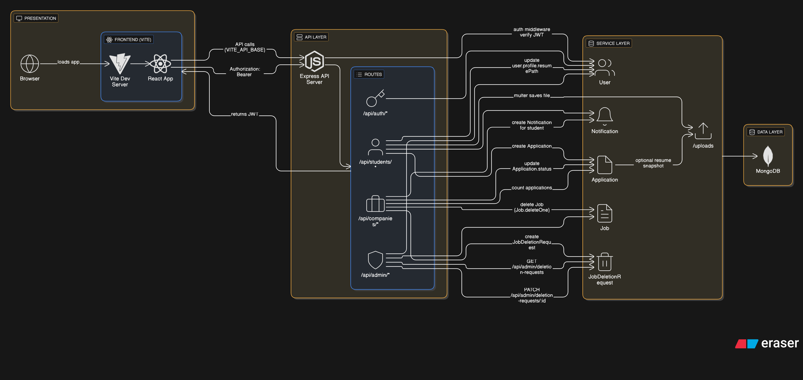

## Architecture Overview — Mermaid Diagram

The following Mermaid diagram shows the system layered architecture and the main runtime flows (auth, uploads, job deletion request). It includes ports, key API routes, models, and frontend/backend responsibilities.

Notes
- Ports: Frontend dev server (Vite) defaults to 5173; backend Express defaults to 4000; MongoDB on 27017. These values are configurable via environment variables (`VITE_API_BASE`, `PORT`, `MONGO_URI`, `UPLOAD_DIR`).
- Auth: JWT tokens are issued by `/api/auth/login` and verified on protected routes by `backend/middleware/auth.js`.
- File uploads: handled by multer in the student route and stored in `uploads/`, which is served statically by `server.js` at `/uploads`.
- Deletion workflow: companies supply a reason when deleting jobs. A `JobDeletionRequest` snapshot is created (includes `jobTitle`) before the job is removed; admins review requests under `/api/admin/deletion-requests`.
